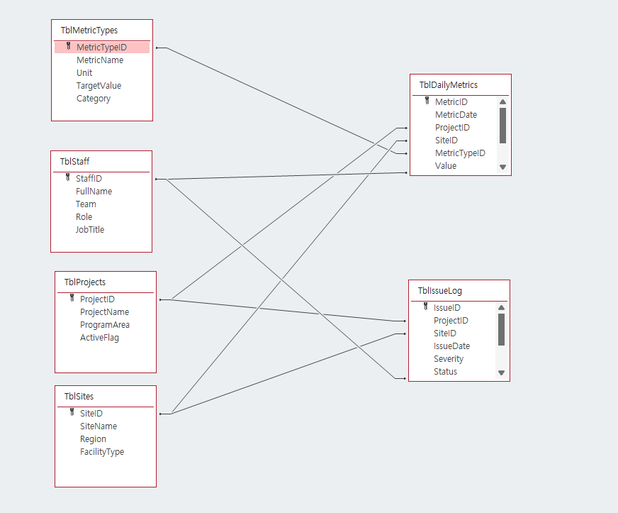
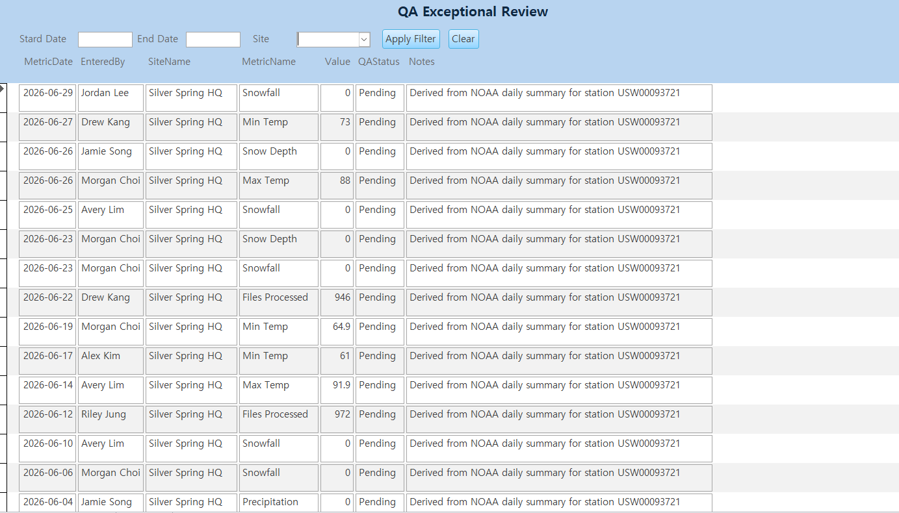
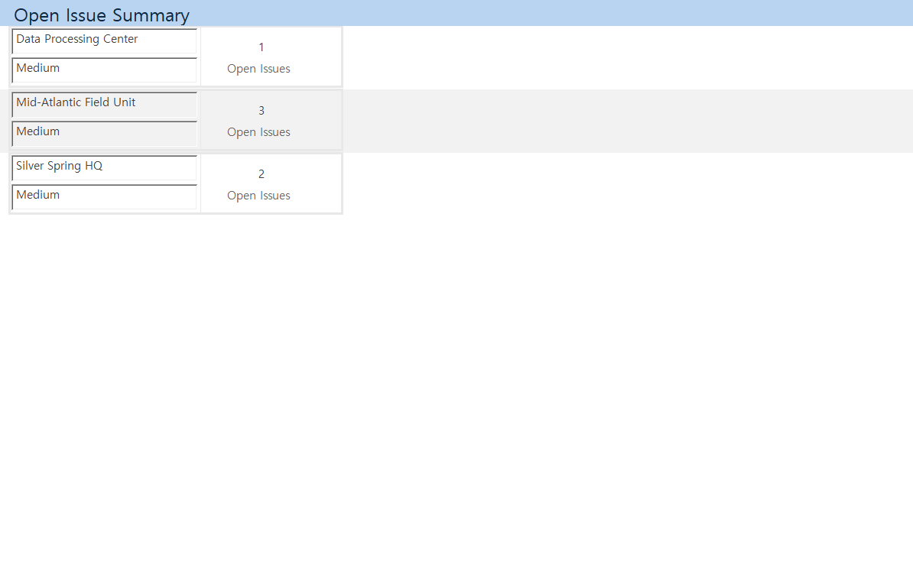
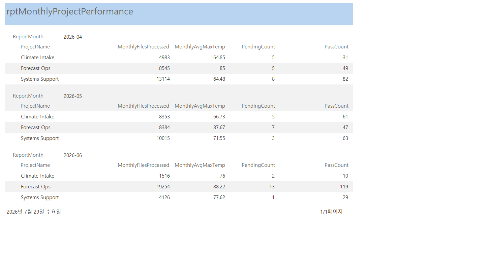

# MS Access project

## Overview
This project is a Microsoft Access portfolio database designed to demonstrate relational database design, operational reporting workflows, query-based monitoring, and management-style reporting.
The database simulates a NOAA-inspired operations environment using QA exceptions, issue tracking, and monthly performance summaries.

## Data Sources and Simulation
This project uses NOAA-inspired sample data rather than raw NOAA production data.
Metric categories, reporting patterns, and operational scenarios were designed to resemble a realistic environmental or operations reporting workflow while remaining safe to publish as a public portfolio project.

Some table structures, sample field ideas, and synthetic records were developed with the assistance of Perplexity as an AI research and planning tool.
The final database design, query selection, form layout, and reporting workflow were adapted and implemented in Microsoft Access as part of the project build.

## Features
- Tracks QA status for daily records and surfaces exceptions for review.
- Summarizes unresolved issues by location and severity for operational monitoring.
- Produces grouped monthly project performance reporting for management review.
- Demonstrates Access forms, queries, filters, and reporting objects in one portfolio project.

## Database Structure
The database is centered on two transaction-style tables: `tblDailyMetrics` and `tblIssueLog`.
Supporting lookup tables such as `tblProjects`, `tblSites`, `tblStaff`, and `tblMetricTypes` standardize values across forms, queries, and reports.

### Core Tables
| Table | Purpose |
|---|---|
| `tblProjects` | Stores project or program names used in operational reporting. |
| `tblSites` | Stores site or facility information for location-based reporting. |
| `tblStaff` | Stores staff names used as data entry personnel or issue owners. |
| `tblMetricTypes` | Defines metric categories such as files processed, snowfall, or max temperature. |
| `tblDailyMetrics` | Main fact table containing daily KPI values, QA status, notes, and related foreign keys. |
| `tblIssueLog` | Stores issue records with severity, status, owner, and resolution tracking. |

### Relationships
The relational model uses one-to-many relationships between master tables and fact tables. This structure supports normalized storage and flexible reporting across projects, sites, metrics, and staff members.

| Parent Table | Child Table | Relationship | Description |
|---|---|---|---|
| `tblProjects` | `tblDailyMetrics` | 1:N | One project can have many daily metric records. |
| `tblSites` | `tblDailyMetrics` | 1:N | One site can have many daily metric records. |
| `tblMetricTypes` | `tblDailyMetrics` | 1:N | One metric type can appear in many daily metric records. |
| `tblStaff` | `tblDailyMetrics` | 1:N | One staff member can enter many metric records. |
| `tblProjects` | `tblIssueLog` | 1:N | One project can have many issue log records. |
| `tblSites` | `tblIssueLog` | 1:N | One site can have many issue log records. |
| `tblStaff` | `tblIssueLog` | 1:N | One staff member can own many issue records. |

### ERD Notes



## Forms and Reports
| Object | Type | Purpose |
|---|---|---|
| `frmQA_Exceptional` | Continuous Form | Reviews QA exception records with optional filters by site and date range. |
| `frmOpenIssueSummary` | Card-style Continuous Form | Displays unresolved issues by location with severity and open issue counts. |
| `rptMonthlyProjectPerformance` | Grouped Report | Summarizes monthly project performance by reporting month and project. |

## Screenshots






## Repository Structure
```text
operations-reporting-dashboard/
├── README.md
├── database/
│   └── OperationsReportingDashboard.accdb
├── docs/
│   └── erd.png
├── screenshots/
│   ├── qa-exceptions.png
│   ├── open-issue-summary.png
│   └── monthly-project-performance.png
└── sql/
    └── sample-queries.md
```
